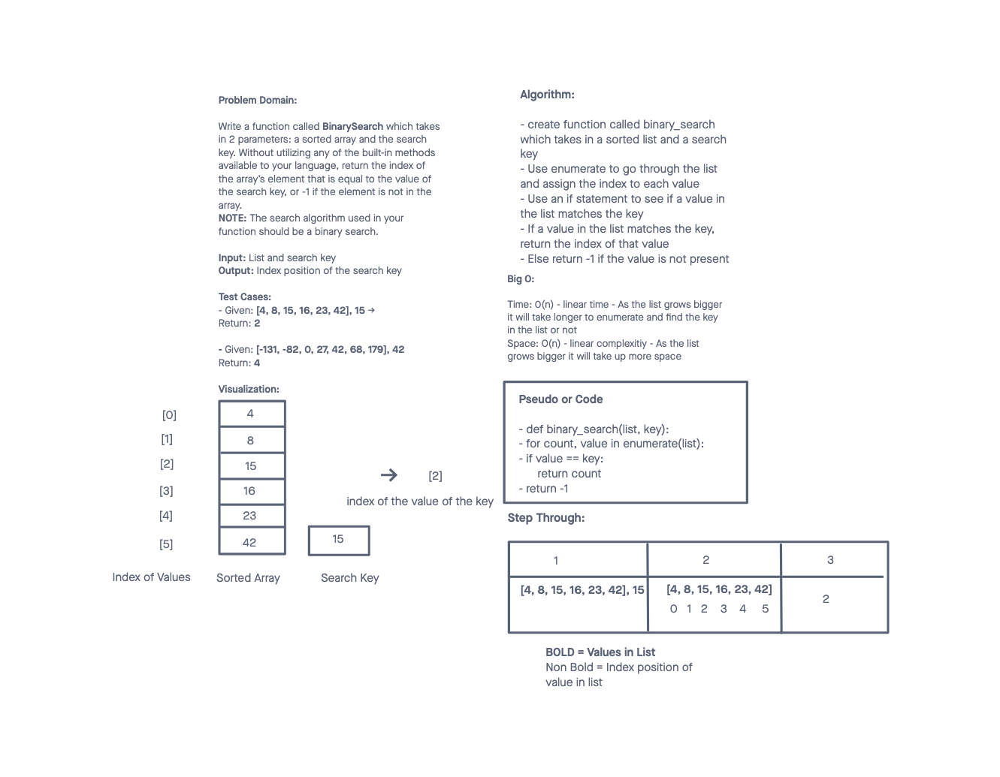

# Binary Search of Sorted Array
<!-- Description of the challenge -->
Write a function called BinarySearch which takes in 2 parameters: a sorted array and the search key. Without utilizing any of the built-in methods available to your language, return the index of the array’s element that is equal to the value of the search key, or -1 if the element is not in the array.
NOTE: The search algorithm used in your function should be a binary search.
Check the Resources section for details

## Whiteboard Process
<!-- Embedded whiteboard image -->

## Approach & Efficiency
<!-- What approach did you take? Discuss Why. What is the Big O space/time for this approach? -->

I used enumerate to go through the list and index all the different values. Then I used an if statement to see if the key was in the list, and if so, return the index of that value. If not, return -1.

This option seemed like a great idea since enumerate adds index position to the list.

For Big O, it was O(n) - linear time and O(n) - linear complexity. As the list grows, it takes longer to traverse to locate the key and takes up more space.
