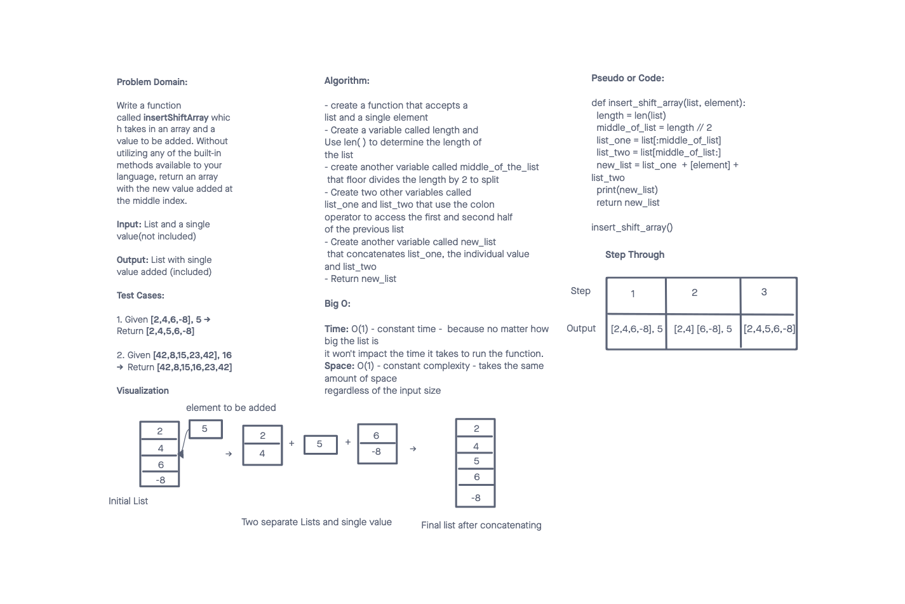

# Insert to Middle of an Array
<!-- Description of the challenge -->

Write a function called insertShiftArray which takes in an array and a value to be added. Without utilizing any of the built-in methods available to your language, return an array with the new value added at the middle index.

## Whiteboard Process
<!-- Embedded whiteboard image -->

## Approach & Efficiency
<!-- What approach did you take? Discuss Why. What is the Big O space/time for this approach? -->

I decided to use length and floor divide by 2 to split the list in half. Then concatenate the the first half of the list, the new value, and the second half of the list.

Time: O(1) - constant time -  because no matter how big the list is it won't impact the time it takes to run the function.

Space: O(1) - constant complexity - takes the same amount of space regardless of the input size

## Attributions

A special thank you to these two websites for helping me with figuring out my solution.

https://appdividend.com/2022/05/30/how-to-split-list-in-python/

https://levelup.gitconnected.com/all-the-ways-to-add-and-remove-items-from-a-list-in-python-c6ee1442244a
