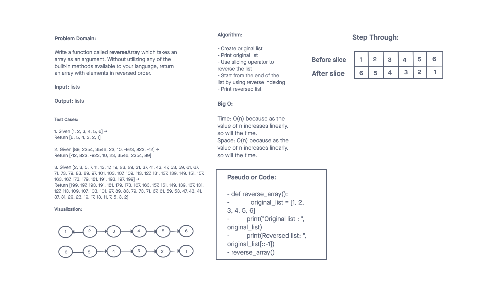

# Reverse an Array
<!-- Description of the challenge -->

Write a function called reverseArray which takes an array as an argument. Without utilizing any of the built-in methods available to your language, return an array with elements in reversed order.

## Whiteboard Process
<!-- Embedded whiteboard image -->

## Approach & Efficiency
<!-- What approach did you take? Discuss Why. What is the Big O space/time for this approach? -->

I decided to use the slicing operation and negative indexing to reverse the array. There were other options like using a for loop but they required more code. This option was simple and required the least amount of code.

The Big O space/time for this approach are both O(n) - linear time complexity. As the size of the list increases so does the time/space it takes to execute.

## References

A special thank you to the website below for helping me solve this problem. They provided quite a few options for reversing an array which was super helpful.

[Fav Tutor](https://favtutor.com/blogs/reverse-list-python#:~:text=Another%20way%20to%20reverse%20the,list%20elements%20will%20be%20reversed.)
