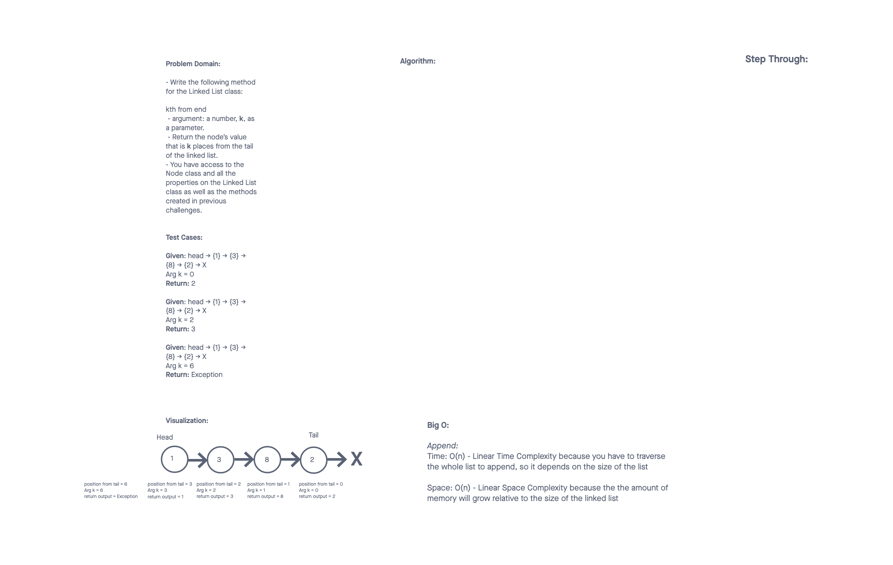

# Challenge Summary
<!-- Description of the challenge -->

Code Challenge 07

Write the following method for the Linked List class:

kth from end
argument: a number, k, as a parameter.
Return the node’s value that is k places from the tail of the linked list.
You have access to the Node class and all the properties on the Linked List class as well as the methods created in previous challenges.

## Whiteboard Process
<!-- Embedded whiteboard image -->

## Approach & Efficiency
<!-- What approach did you take? Why? What is the Big O space/time for this approach? -->

## Solution
<!-- Show how to run your code, and examples of it in action -->

## Attributions

A special thank you to ChatGPT which helped me wrap my head around different ways to solve the problem. I didn't finish because I needed to refactor a couple things to pass a couple tests but still.
