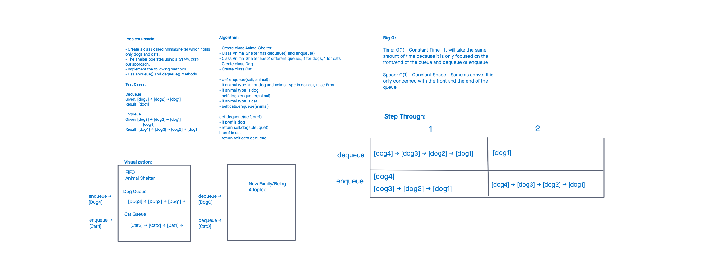

# Challenge Summary - Code Challenge 12
<!-- Description of the challenge -->

- Create a class called AnimalShelter which holds only dogs and cats.
- The shelter operates using a first-in, first-out approach.
- Implement the following methods:

- enqueue
Arguments: animal
animal can be either a dog or a cat object.

- dequeue
Arguments: pref
pref can be either "dog" or "cat"
Return: either a dog or a cat, based on preference.
If pref is not "dog" or "cat" then return null.

## Whiteboard Process
<!-- Embedded whiteboard image -->

## Approach & Efficiency
<!-- What approach did you take? Why? What is the Big O space/time for this approach? -->

Big O:

Time: O(1) - Constant Time - It will take the same amount of time because it is only focused on the front/end of the queue and dequeue or enqueue

Space: O(1) - Constant Space - Same as above. It is only concerned with the front and the end of the queue.

## Solution
<!-- Show how to run your code, and examples of it in action -->
