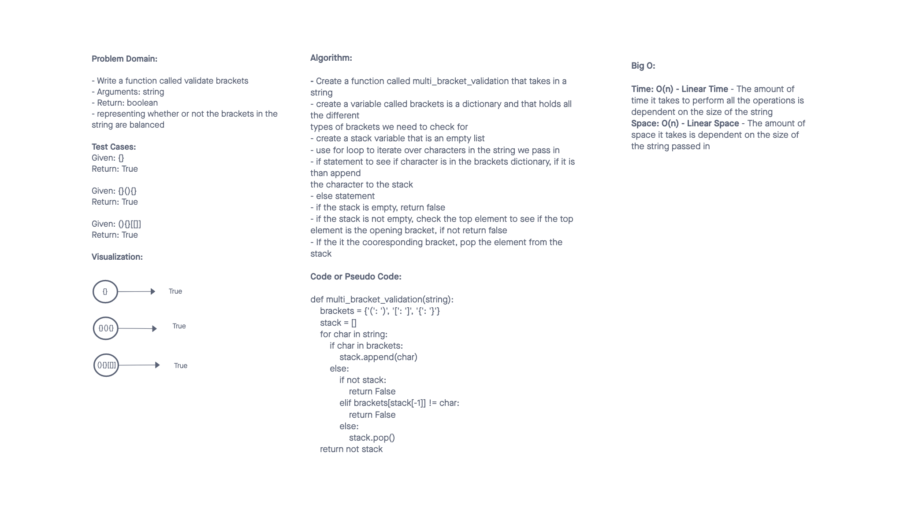

# Challenge Summary
<!-- Description of the challenge -->

- Write a function called validate brackets
Arguments: string
Return: boolean
representing whether or not the brackets in the string are balanced
There are 3 types of brackets:

Round Brackets : ()
Square Brackets : []
Curly Brackets : {}

## Whiteboard Process
<!-- Embedded whiteboard image -->

## Approach & Efficiency
<!-- What approach did you take? Why? What is the Big O space/time for this approach? -->

 I created a dictionary with all the valid types of brackets. I used a for loop to iterate over the characters in the string that was
passed in to check to see if they had any brackets in them. I created an
variable called stack that was an empty list. I then used a for loop to iterate
through the string to check to see if there. If the bracket is there append it to the
stack variable. If it's not in the stack return false.

Big O:

Time: O(n) - Linear Time - The amount of time it takes to perform all the operations is dependent on the size of the string

Space: O(n) - Linear Space - The amount of space it takes is dependent on the size of the string passed in

## Solution
<!-- Show how to run your code, and examples of it in action -->

## Attributions

A special thank you to ChatGPT. I understood the problem but was having trouble with the conditional logic. I need that I would most likely need to itereate over the string using a for loop. But ChatGPT helped me understand the logic better and explain step by step a way to address this problem.
