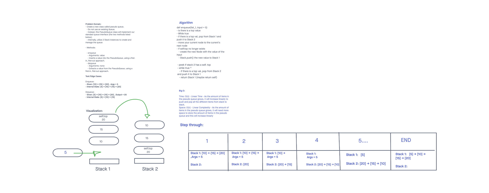

# Challenge Summary - Code Challenge 11 - Pseudo Queue
<!-- Description of the challenge -->

- Create a new class called pseudo queue.
  - Do not use an existing Queue.
  - Instead, this PseudoQueue class will implement our standard queue interface (the two methods listed below),
  - Internally, utilize 2 Stack instances to create and manage the queue

- Methods:

  - enqueue
    - Arguments: value
    - Inserts a value into the PseudoQueue, using a first-in, first-out approach.
  - dequeue
    - Arguments: none
    - Extracts a value from the PseudoQueue, using a first-in, first-out approach.

## Whiteboard Process
<!-- Embedded whiteboard image -->

## Approach & Efficiency
<!-- What approach did you take? Why? What is the Big O space/time for this approach? -->

Big O:

Time: O(n) - Linear Time - As the amount of items in the pseudo queue grows, it will increase linearly to push and pop all the different items from stack to stack.

Space: O(n) - Linear Complexity - As the amount of items in the pseudo queue grows, it will need more space to store the amount of items in the pseudo queue and this will increase linearly

## Solution
<!-- Show how to run your code, and examples of it in action -->

The approach I used was to use two stacks and simply a combination of pop
and push to move elements over from stack_a to stack_b. This allows the
two stacks to act like a Pseudo Queue. You move all the elements from stack A to
stack B and then elements from stack B back over to a after new element has been
added to stack A.

