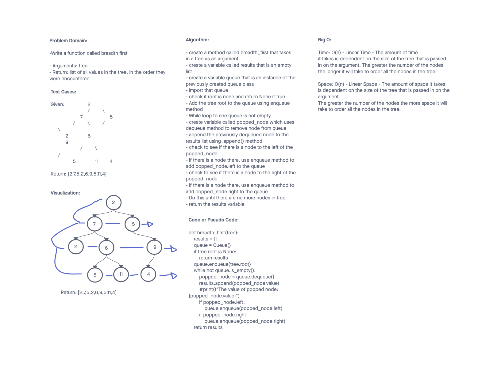

# Challenge Summary
<!-- Description of the challenge -->

Code Challenge 17:

Write a function called breadth first
Arguments: tree
Return: list of all values in the tree, in the order they were encountered

## Whiteboard Process
<!-- Embedded whiteboard image -->

## Approach & Efficiency
<!-- What approach did you take? Why? What is the Big O space/time for this approach? -->

I created a variable called results to hold all the nodes in tree for the breadth_first() traversal. I used a queue as a way to temporarily add/remove
nodes while returning them in the correct order. I used a while loop to check to see if the queue is not empty, then I iterate through to see if there are left and right nodes for each parent node. I then enqueue those nodes to get them in the right order. I eventually return the results list with the breadth first order of all the nodes in the tree

Big O:

Time: O(n) - Linear Time - The amount of time

it takes is dependent on the size of the tree that is passed
in on the argument. The greater the number of the nodes
the longer it will take to order all the nodes in the tree.

Space: O(n) - Linear Space - The amount of space it takes
is dependent on the size of the tree that is passed in on the argument. The greater the number of the nodes the more space it will take to order all the nodes in the tree.

## Solution
<!-- Show how to run your code, and examples of it in action -->

## Attributions

A special thank you to Tammy Do. I've been working with her as my tutor and she helped me with this code challenge. We broke things down step by step. She also suggested I review my Queue Class when the tests weren't passing because the way I set it up was giving us not the expected results.
