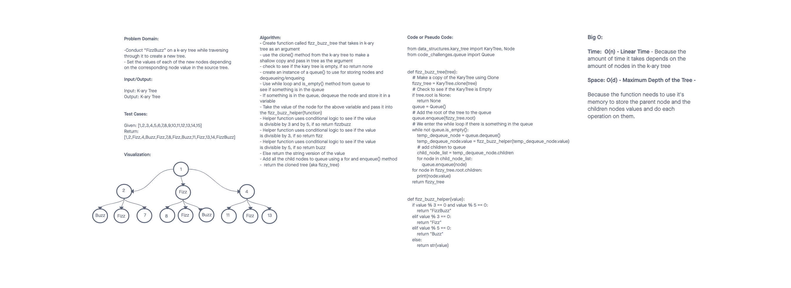

# Challenge Summary
<!-- Description of the challenge -->

Code Challenge 18

Conduct “FizzBuzz” on a k-ary tree while traversing through it to create a new tree.

Set the values of each of the new nodes depending on the corresponding node value in the source tree.

## Whiteboard Process
<!-- Embedded whiteboard image -->

## Approach & Efficiency
<!-- What approach did you take? Why? What is the Big O space/time for this approach? -->

The Approach I took was to add all the values of the nodes in the k-ary tree to a queue and use dequeue/enqueue methods to add and remove. I made a copy of the K-ary tree and then checked to see if the root was none. I created an instance of a Queue and enqueded the root to the queue. Then I used a while loop to see if the queue had something in it, if it does we dequeue the node and pass it into the fizz_buzz_helper method which checks to see if it is divisible by 3,5, or both and returns Fizz, Buzz, or FizzBuzz. If not, return the value of the node. Then I added all the children to the queue using enqueue. The while loop repeats until it is empty, then I return the cloned copy of the tree that has been adjusted to include the fizz, buzz, and fizzbuzz.

Big O:

Time:  O(n) - Linear Time - Because the amount of time it takes depends on the amount of nodes in the k-ary tree

Space: O(d) - Maximum Depth of the Tree - Because the function needs to use it's memory to store the parent node and the children nodes values and do each operation on them.

## Solution
<!-- Show how to run your code, and examples of it in action -->

pytest test_tree_fizz_buzz.py

## Attributions

A special thank you to Tammy Do. She's been tutoring me and she helped me with this problem. This is really helping me break down the problems and take things one step at a time. She suggested using a helper function to do the conditional logic for fizzbuzz section. Tammy is an excellent teacher and I've very grateful I can work with her.

Another special thank you to ChatGPT. I wasn't sure about the Big O Space Time Complexity so I asked. I wouldn't have guessed O(d) so thankful that advanced tech like this exists and can be leveraged to help us learn better.
