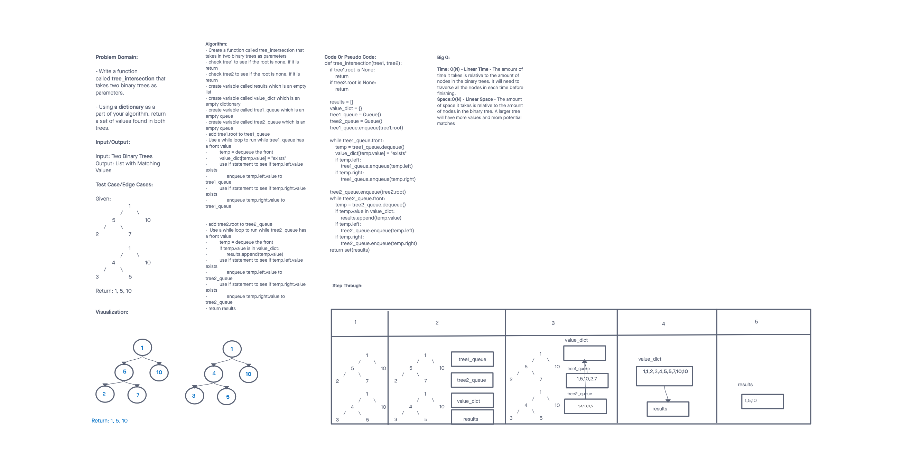

# Challenge Summary
<!-- Description of the challenge -->

Code Challenge 32 - Tree Intersection

## Whiteboard Process
<!-- Embedded whiteboard image -->

## Approach & Efficiency
<!-- What approach did you take? Why? What is the Big O space/time for this approach? -->

I used a strategy that involved a list, dictionary, and two queues. I added the nodes to a queue and then added the values of the nodes to two different queues. The queues would then add the value of each node into a dictionary. The dictionary would then story all the values and it would take the multiple values and append them to the list. I return the list as a set which removes duplicates and returns a list with all values that appear in both trees.

Big O:

Time: O(N) - Linear Time - The amount of time it takes is relative to the amount of nodes in the binary trees. It will need to traverse all the nodes in each time before finishing.

Space:O(N) - Linear Space - The amount of space it takes is relative to the amount of nodes in the binary tree. A larger tree will have more values and more potential matches

## Solution
<!-- Show how to run your code, and examples of it in action -->

## Attributions

Thank you to Tammy Do my tutor she helped me with coming up with parts of the algorithm and talking to the problem/solution.

