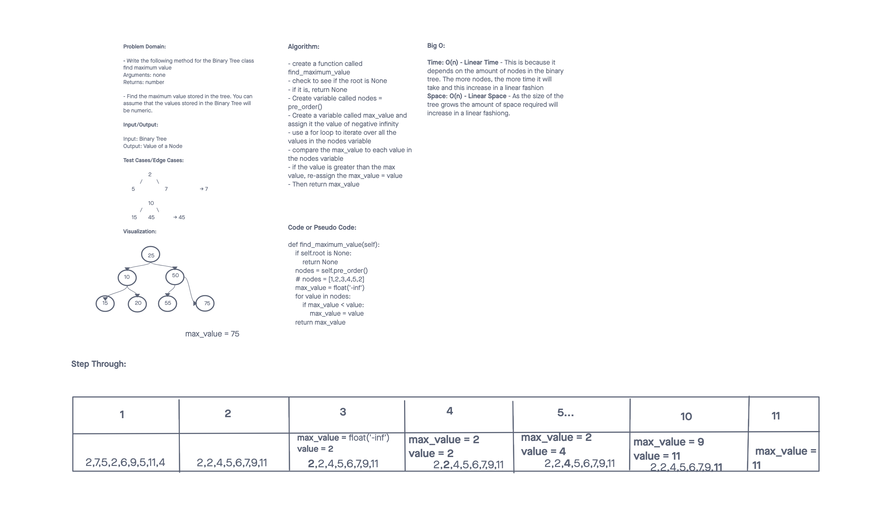

# Challenge Summary
<!-- Description of the challenge -->

Code Challenge 16 - Tree Max

Write the following method for the Binary Tree class:

- find maximum value
- Arguments: none
- Returns: number
- Find the maximum value stored in the tree.
- You can assume that the values stored in the Binary Tree will be numeric.

## Whiteboard Process
<!-- Embedded whiteboard image -->

## Approach & Efficiency
<!-- What approach did you take? Why? What is the Big O space/time for this approach? -->

I used the pre_order method from the Binary Tree class to order the node values from lowest to highest. Then I used an iterative approach where I used a for loop to iterate over the values of the nodes in the Binary Tree. Each time it would check to see if the value in the tree was greater than the current max value, and if it was we would re-assign value to the max_value variable. Finally return the max_value variable at the end.

Big O:

Time: O(n) - Linear Time - This is because it depends on the amount of nodes in the binary tree. The more nodes, the more time it will take and this increase in a linear fashion

Space: O(n) - Linear Space - As the size of the tree grows the amount of space required will increase in a linear fashiong.

## Solution
<!-- Show how to run your code, and examples of it in action -->

## Attributions

A special thank you to Tammy Do. She's been tutoring and helping me break down the code challenges to step by step. This has been a big help and even though it's been slow, I feel that I'm definitely moving in the right direction.
