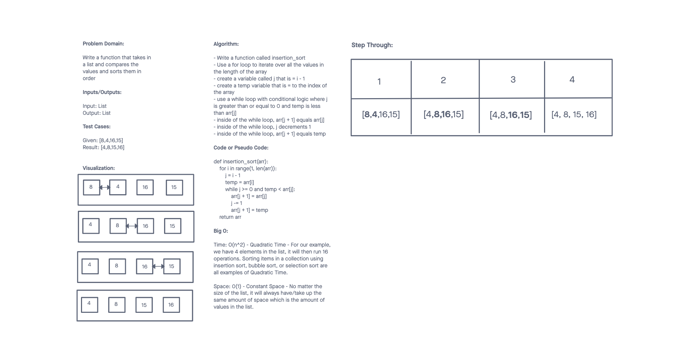

# Challenge Summary
<!-- Description of the challenge -->

 Insertion Sort
Write a function to sort and insert all the values in an array into the correct placement from lowest to highest

## Whiteboard Process
<!-- Embedded whiteboard image -->

## Approach & Efficiency
<!-- What approach did you take? Why? What is the Big O space/time for this approach? -->

I used an iterative approach by looping over the contents of the array to compare each value and then move it to the left if it is the lower value.

Big O:

Time: O(n^2) - Quadratic Time - For our example, we have 4 elements in the list, it will then run 16 operations. Sorting items in a collection using insertion sort, bubble sort, or selection sort are all examples of Quadratic Time.

Space: 0(1) - Constant Space - No matter the size of the list, it will always have/take up the same amount of space which is the amount of values in the list.

## Solution
<!-- Show how to run your code, and examples of it in action -->

## Attribution

A special thank you to GeeksForGeeks for helping me with this code challenge. The article link is listed below:

https://www.geeksforgeeks.org/insertion-sort/
